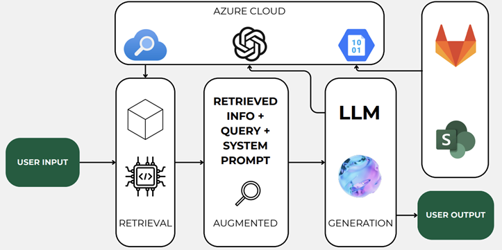
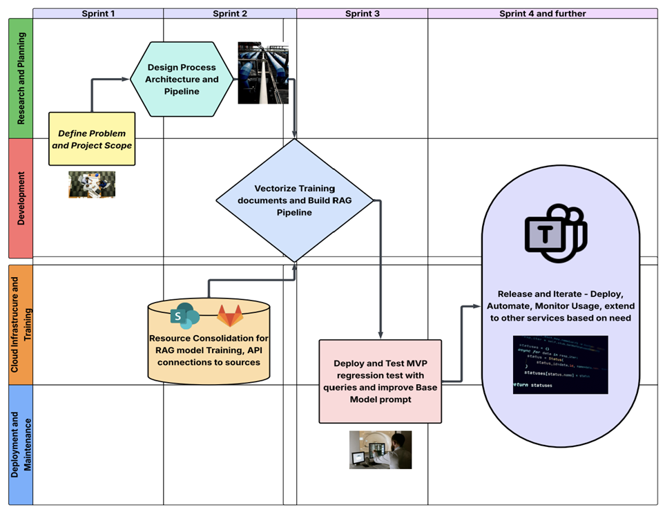

# GitMyWiki – COUNTRY’s own AI virtual Assistant
### Irith Chaturvedi
### IS 340 – Project Management
#### Final Term Paper
---
## Abstract:

To tackle the hassle that comes with using large information stores for information and file retrieval, we have devised GitMyWiki, a RAG based AI virtual assistant trained on all internal documentation within GitLab and SharePoint – a one stop solution for the technical and business teams to save time on using the direct search options on the information stores which do a poor job of information retrieval. The solution provides contextual answers to your queries along with direct links to the projects and files you aim to access. The project emphasizes collaboration between all technical and business teams at COUNTRY Financial to help us add their internal documentation to the application, while using COUNTRY’s in-house Azure AI services to build the RAG pipeline for the application. 

The project requires a team of 4 interns from various teams and technical backgrounds, with experience implementing AI models into frameworks and interns who have worked closely with the business professionals and understand their needs in terms of designing an accessible and user-friendly interface. The solution aims to employ an average of 375 hours daily by 1500 company employees searching through internal documentation, to better and highly optimal use. With GitMyWiki, the company enhances employee productivity, improves onboarding and new employee training and reduces context-switching by integrating directly into platforms that employees already utilize.

---
## Introduction:

Organizations like COUNTRY Financial generate enormous documentation, creating search friction and knowledge silos across teams. Much of this information remains locked behind poor search systems that return every occurrence of a keyword rather than surfacing contextually relevant content. Onboarding of new and existing employees within teams and projects also takes a backseat when the information and resources they require are hidden behind curtains of trivial data. Retrieval Augmented Generation within the upcoming AI era comes as a panacea to our organization wide problem, where LLM models can be trained on internal documentation directly such that when these models are queried and asked questions, they can cite the exact link to the information you are looking for, while providing the user context specific answers to confirm whether the output is what they are looking for improving its future response through reinforcement learning, a key trait for modern LLMs. 
GitMyWIki, an AI assistant built on these principles, will help not only save the organization time and money, but owing to the sensitive internal information used by COUNTRY Financial, will make sure that the training data used is exclusive to the model and the company’s employees themselves. A universally accessible knowledge engine built on majority open-source software keeps in mind the technical debt, using Python as its foundation, a language that is easy to learn and use, while also using Streamlit to design the frontend. The two frameworks are increasingly becoming popular with AI and ML based solutions due to their flexibility and interoperability across various use cases. As the solution also aims to collaborate with all teams across the organization to host their internal documentation, it adds to the tenets of community stewardship. Beyond addressing search friction, GitMyWiki also emerges at a moment when automation is reshaping how projects, knowledge systems and collaborative spaces are managed. By employing communicative development throughout the design process, avoiding anti-patterns of atomistic teams, we want to design a model for sustainable and inclusive project management.

---
*GitMyWiki demonstrates how agile development, sustainable automation practices, and responsible technical debt management can be combined to transform organizational knowledge-sharing by empowering diverse internal audiences, fostering cross-team collaboration, and building an adaptable, open-source-inspired platform that evolves alongside the needs of COUNTRY Financial.*

---
## Background:

The motivation for GitMyWiki began long before the first line of code was written. As a Data Science and Project Manager Intern at COUNTRY Financial, I repeatedly found myself struggling to locate even the most basic internal resources. Whether searching through GitLab repositories, going through SharePoint folders, and scrolling through the endless Wiki documentation, the experience was highly frustrating. These tools lacked a cohesive and intelligent retrieval system. They delivered results based purely on keyword matching, returning hundreds of loosely related documents instead of the specific, context-rich information I needed. Funnily enough, the results were never sorted by a metric such as date of creation, or number of members with access to the resource (which could rank it as frequently used or important). What should have been a simple query often resulted in a time-consuming scavenger hunt.
To determine whether this issue extended beyond my personal experience, I interviewed 22 employees across data engineering, analytics, and operations teams. They shared the same pain as me and on average, employees reported spending 15 to 30 minutes each day trying to locate documentation, or worse, interrupting teammates or managers for answers that should have been easily discoverable. When extrapolated across COUNTRY Financials 1,500 employees, the scale of the problem becomes difficult to ignore. Collectively, these small daily inefficiencies translate into thousands of lost workhours each month, time that could instead support product development, or strategic initiatives which are clearly more beneficial to the company. These interviews also revealed a deeper cost where employees felt discouraged when they couldn’t find the information needed to do their jobs effectively. Knowledge silos formed unintentionally, onboarding timelines grew longer, and confidence in documentation systems declined, a clear case of automation mismanagement. GitMyWiki aims to restore trust in internal tools while enabling employees to spend less time searching and more time creating value for the organization.

---
## Proposed Solution:

GitMyWiki, as the name suggests, proposes an AI-powered knowledge retrieval platform that sits directly on top of COUNTRY Financials, two most used information stores, GitLab and SharePoint. It transforms them into intelligent, and context aware search interfaces. It is deployed using a lightweight widget, very similar to how commercial websites embed chatbots making it immediately familiar and accessible to employees. For the current MVP however, the solution will be deployed on Streamlit, and will have a ChatGPT like interface, which most people already have experience using to provide a gentle learning curve. Although on the surface the application seems simple, it masks a highly engineered pipeline beneath that automatically ingests documentation, enriching it with semantic understanding and delivering relevant responses complete with source citations to add accountability. With this, we replace a fragmented documentation ecosystem with a smooth, and efficient resource retrieval interface.
 

Each team within COUNTRY Financial maintains their own GitLab and SharePoint project tokens, these API credential grant secure access to internal documentation. Using these tokens, the pipeline recursively retrieves Wiki documentation pages from every project, subdirectory and repository within that project, converts them to markdown format for easy ingestion by the model, and stores them into Azure Blob Storage. This keeps the file formats standard across teams and provides a structure that is optimized for LLM processing. A markdown format also ensures human readability, which is a great countermeasure for anti-patterns of working with opaque architecture. Using Azure OpenAI Embedding models, text embeddings are generated for every file and saved within the file metadata. The combined metadata with the embeddings, file location and last modified date are stored in a vector database, which uses Azure Vector Search as the retrieval engine and maps every user query to the most apt and relevant documentation, instead of just using the traditional keyword matches.

Along with returning direct hyperlinks to the original documentation, using the base prompt along with the user prompt, a context specific response is generated too. This ensures both transparency and traceability, adding accountability to the responses, crucial for automation in development. As mentioned earlier, the result is delivered back to the user in a chat-style interface for the MVP, which provides a humanized touch to the highly technical infrastructure. The solution embodies the best practices of modern DevOps automation, minimizing technical debt by implementing a Python based backend, Streamlit frontend and Azure AI Services, that will continue to be prominent with time. When deployed using Azure Container Services, the application can simultaneously handle 500-1000 users, suitable for the current size of the organization.

---
## Target Audience:

GitMyWiki is specifically designed for employees across COUNTRY Financial who rely on GitLab and SharePoint within their documentation ecosystem. As it integrates with both platforms, it serves all spectrum of users, from technical engineering teams to business stakeholders. By serving all users with equal ease, it is a highly inclusive and accessible tool. The system’s design and interface intentionally minimize complexity for the end users. The familiarity provided by the chat-like interface and conversational style of modern LLM’s utilizing reinforcement learning to provide responses, makes it beneficial for users not accustomed to command-line tooling or more technical interfaces. (Nielsen, 1993)

The long-term vision for the application includes extending it to additional platforms used across the organization. One such system is SailPoint, used to request application or resource access. Adding SailPoint documentation with GitMyWiki could potentially help users with a-bridged questions, with location of information required, and who to request access from based on if it has restrictions. This is mainly a future scope consideration contingent on user response and feedback.

---
## Project Phases:

The development of GitMyWiki follows a four-sprint structure, each handling a major phase of research, design and deployment. The diagram above depicts the progression from fundamental planning to automated scalability. Each sprint follows on from the previous one, focusing on collaboration and calls across the different team members involved through daily sync meetings for project updates. (Fowler, 2001)

### Sprint 1: Research and Planning
The project timeline begins with introducing and defining the problem to establish the project scope and understand the final deliverables. As done previously, it will still include interviews with COUNTRY Financial employees to expose their pain points with using the in-house information stores, and the search friction caused by them leading to loss of motivation and potential project delays. Using these insights, we will conclude the sprint by creating a high-level architecture diagram of the pipeline, from ingestion to RAG model creation and frontend hosting along with future integration with GitLab and SharePoint. All possible technical debt along with expiration of API keys, languages and frameworks used will be addressed in this period, Information store API tokens for every team, and access to Azure resources to generate OpenAI Chat Playground tokens will be requested for.

### Sprint 2: Design and Pipeline Development
Here the focus moves to actual development, designing the ingestion framework by using the GitLab and SharePoint tokens derived from teams across COUNTRY Financial during Sprint 1. This will be followed by converting these PDF pages into Markdown format to ensure optimized human and model readability of these documents. They will then be stored on Azure Blob Storage. The vectorization process, embedding generation, and metadata structuring are also designed during this sprint, setting the stage for semantic search capabilities. By the end of Sprint 2, the project will have a robust processing pipeline ready for cloud integration.

###	Sprint 3: Cloud Infrastructure and MVP Deployment
With the ingestion and vectorization pipeline built, Sprint 3 will focus on cloud integration, i.e. making use of the OpenAI Chat Playground API tokens procured during Sprint 1 to establish a connection to the GPT-5 model. All files are uploaded to our Azure resource, indexed using Azure OpenAI Embedding models and storing those embeddings in Azure Vector DB for fast lookup. A base prompt requiring the OpenAI model to only make use of the Azure resource documents uploaded to produce responses will be set, while the user input would be additional to the base prompt, providing context as to what information needs to be looked up within our information stores. Once this infrastructure is in place, the MVP (Minimum Viable Product) will be deployed by hosting the pipeline on a Streamlit frontend web application, with regression testing using employee queries. This will help assess the accuracy of the responses, and whether the base prompt would require any refinement. It can also help add to the README file that is presented as documentation along with the application, so that users know the quality of the query they must provide to get the best possible responses. GitMyWiki will be, will be packaged on Azure Container Services for standardization of requirements needed to run the web application.

###	Sprint 4 and Beyond: Release, Automation and Extension
After the MVP has been validated, Sprint 4 will mainly focus on long term sustainability. We will introduce automated monthly ingestion pipeline runs using Zena job automation software (already in use at COUNTRY Financial) so that updated documentation that would require regenerated embedding are all catered for. Further iterations to the application UI based on user feedback will be carried out to make it as user-friendly as possible. These will be released as updates to the application, on a regular basis. Based on user responsiveness and organizational needs, the project roadmap includes extending support to platforms such as SailPoint, allowing employees to query information related to application access or permissions.

---

## Features and Technical Stack:
1.	Automated Documentation Ingestion and format Standardization
-	Tech Stack: GitLab API, SharePoint API, Python for Scripting, Azure Blob Storage
A central feature of GitMyWiki is to automatically ingest documentation across the information stores. The recursive retrieval process using the API tokens scans every documentation page and sub directory, converting those pages to markdown format and storing them on Azure Blob Storage.
2.	Semantic Vectorization and Metadata updating
-	Tech Stack: Azure OpenAI Embedding Model, Python, Azure Vector DB, Azure Vector Search
For context-aware search, GitMyWiki uses an Azure embedding model to generate text embeddings that capture semantic meaning from a document, allowing the user queries and prompts to be matched to the document using the intent in the question. These embeddings are added to the metadata along with file paths and timestamps.
3.	RAG Pipeline
-	Tech Stack: Azure AI Search, OpenAI GPT-5 Playground, Python, Azure App/Container Services
When a user poses a question, the system performs vector search against the indexed embeddings, retrieving the most relevant document chunks. This augmented prompt is passed to GPT-5 through Azure OpenAI, generating a well-structured response along with direct hyperlinks to the original documentation.
4.	Chat-Style UI and future Widget Integration
-	Tech Stack: Streamlit, Python backend
Building a conversational UI for the MVP with Streamlit, the UI itself will imitate ChatGPT so that users are familiar enough with the interface, regressing the learning curve and producing little to no technical debt.
5.	Automated Monthly Vector Refresh Pipeline
-	Tech Stack: Azure Key Vault, Python automation script, Azure Scheduling
To ensure that the knowledge base remains fresh, the solution includes an automated monthly refresh pipeline. Using the metadata timestamp, it checks and compares any updates to the documentation and uploads them to the Vector DB following the ingestion pipeline. As this is run monthly, it adds automation while reducing manual workload, while improving consistency. 

---
### Sustainability and Technical Debt:
GitMyWiki is built with Long-term sustainability in mind. The monthly refresh pipeline is a core part of the application as it interacts with the critical documentation that evolves frequently, yet accounts for it at every stage. By relying on standardized markdown conversion and a consistent ingestion framework, the project avoids any uncertainties that may arise from user-computer interactions.
Simplicity is the key for the product’s success, by not steering away from the 3 core services of Python, Azure and Streamlit, the tech stack is intentionally minimal and modular. Owing to this, all components of ingestion, embedding, retrieval and the final interface can be updated or replaced without affecting the system much, and by launching simple updates to the containerized application.
The community participation for GitMyWiki, within COUNTRY Financials’ teams, will have a direct impact on the sustainability of the application. Teams can contribute documentation improvements, suggest feature enhancements and surface errors early in the development pipeline after the MVP launch, reducing future operational burden on the developers and maintainers. will guide refinement of retrieval accuracy, interface usability, and model prompting strategies. (Kruchten, 2012)

---
## Conclusion:

GitMyWiki represents a meaningful step toward transforming the way COUNTRY Financial organizes, accesses, and maintains its institutional knowledge. What began as an observation of scattered documentation and inefficient search practices evolved into a comprehensive solution grounded in RAG, automation, and open-source design principles. By consolidating GitLab and SharePoint content into a unified semantic search engine, GitMyWiki addresses the organizational pain points revealed through interviews and internal research, namely, that employees spend significant time locating information that should be readily accessible. The system returns not just answers, but context, citations, and clarity, restoring trust in documentation and supporting employees in doing their best work.
Across its development lifecycle, through each sprint, from scoping to pipeline development, deployment, and iteration was intentionally designed to avoid the pitfalls of fragmentation and technical debt, while leveraging automation to create a system that scales sustainably. The platform’s modularity ensures that future integrations, such as SailPoint, can be added without disrupting existing functionality, allowing the system to evolve in response to user needs.
In the end, it is a platform for collaborative knowledge sharing within COUNTRY Financial. It empowers and motivates teams to regularly contribute documentation improvements, report issues and suggest new features. As the organization moves deeper into the AI-driven era, GitMyWiki stands as both a practical solution and a creative foundation for future knowledge-management innovation.

---
## References:
1. Fowler, Martin & Highsmith, Jim. “The Agile Manifesto.” (2001)
https://cs.furman.edu/~tallen/csc475/materials/The_Agile_Manifesto_SDMagazine.pdf

2. Kruchten, Nord, & Ozkaya. “Technical Debt: From Metaphor to Theory.” IEEE Software, 2012.
https://ieeexplore.ieee.org/document/6336722

3. Nielsen, Jakob. “Usability Engineering.” Morgan Kaufmann, 1993.
https://dl.acm.org/doi/pdf/10.5555/2821575